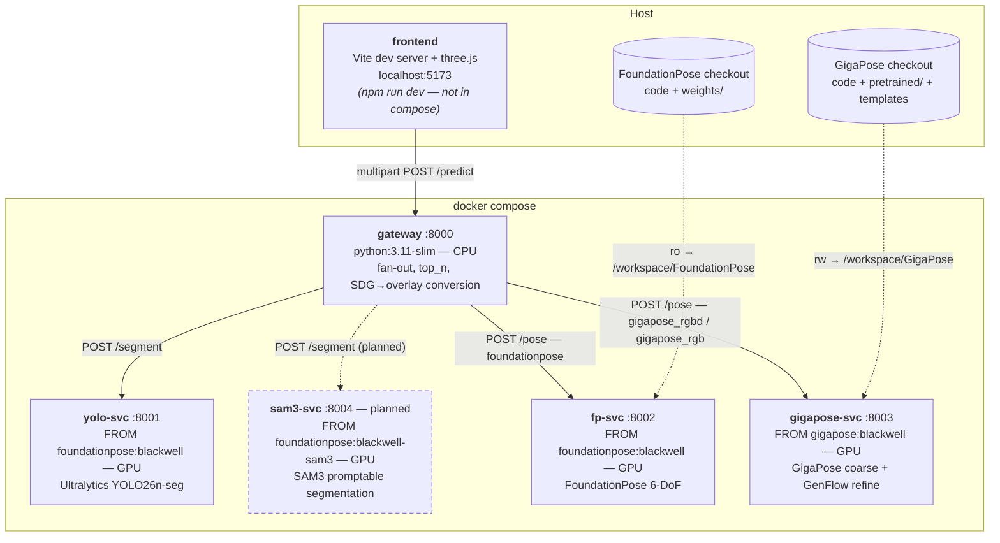

# kip-pose-viewer

A browser tool for 6-DoF pose estimation. Upload an RGB image, a depth map
(uint16 millimetres) and camera intrinsics; the tool runs instance
segmentation (**YOLO26n-seg** today; promptable **SAM3** segmentation is in
progress), hands each instance to a 6-DoF pose estimator (**FoundationPose**
or **GigaPose**), and renders the result in either of two viewer modes:

- **2D overlay** — the RGB image as a backdrop with per-object instance masks
  drawn translucent on top, plus projected coordinate triads. There is no mesh
  in 2D mode (a 3D mesh is meaningless on a flat image).
- **3D scene** — an orbitable camera over semi-transparent solid meshes and
  coordinate triads, with an optional ground grid and an optional back-projected
  point cloud.

Both modes overlay **ground truth vs. prediction**: ground truth is drawn in
**green**, prediction in **magenta**, while coordinate triads keep the usual
RGB = XYZ colouring (ground-truth triads dashed, prediction triads solid). Every
layer toggles globally and per-object — the sidebar carries separate
**Prediction** and **Ground-truth** object lists so individual instances can be
shown or hidden.

## Architecture

Two independent stages, both selectable in the frontend: the **segmentation
source** (ground-truth masks, YOLO26n-seg, or — in progress — SAM3) produces
instance masks, and the **pose estimator** (FoundationPose, GigaPose RGB-D,
or GigaPose RGB-only) consumes them. GigaPose is a pose estimator, not a
segmenter, so it never appears in the segmentation dropdown.



| service        | port | base image                       | GPU | host mounts                                              | role                                   |
| -------------- | ---- | -------------------------------- | --- | -------------------------------------------------------- | -------------------------------------- |
| `gateway`      | 8000 | `python:3.11-slim`               | –   | –                                                         | CORS, fan-out, merge, SDG conversion    |
| `yolo-svc`     | 8001 | `foundationpose:blackwell`       | ✓   | YOLO weights → `/weights/best.pt` (ro)                    | instance segmentation (YOLO26n-seg)     |
| `fp-svc`       | 8002 | `foundationpose:blackwell`       | ✓   | FoundationPose checkout → `/workspace/FoundationPose` (ro), `assets/meshes` → `/assets/meshes` (ro) | 6-DoF pose (FoundationPose) |
| `gigapose-svc` | 8003 | `gigapose:blackwell`             | ✓   | GigaPose checkout → `/workspace/GigaPose` (rw)            | 6-DoF pose (GigaPose + GenFlow)         |
| `sam3-svc`     | 8004 | `foundationpose:blackwell-sam3`  | ✓   | *(planned — image built, service not yet in compose)*     | promptable segmentation (SAM3)          |

The GPU services build on two locally-built base images —
`foundationpose:blackwell` (torch 2.11.0+cu128 for Blackwell sm_120; the
`-sam3` variant adds `transformers>=5` + `accelerate`) and `gigapose:blackwell`
— and require the NVIDIA Container Toolkit. The gateway is CPU-only; the
frontend runs on the host, outside compose.

## Prerequisites

- **`foundationpose:blackwell` base image** built locally (used by `yolo-svc`
  and `fp-svc`). Built from `docker/Dockerfile.blackwell` in the FoundationPose
  checkout. Check with `docker image ls | grep foundationpose`.
- **`gigapose:blackwell` base image** built locally (used by `gigapose-svc`; a
  separate base — GigaPose pins xformers/pytorch-lightning against an older
  torch). Built from `docker/Dockerfile.blackwell` in the GigaPose checkout.
- **NVIDIA Container Toolkit** (`nvidia-container-toolkit`) installed and
  configured so Docker can pass `--gpus all` to containers.
- **FoundationPose checkout** (code + model weights; mounted read-only into
  `fp-svc`). Path set via `FOUNDATIONPOSE_DIR`, see below.
- **GigaPose checkout** with `pretrained/`, `datasets/kip2/models` and rendered
  templates (`datasets/templates/kip2`); mounted rw into `gigapose-svc`. Path
  set via `GIGAPOSE_DIR`, see below.
- **YOLO weights** (`.pt`, class ids `0=anker_kurz`, `1=anker_lang`). A trained
  copy is bundled at `assets/weights/best.pt`; path set via `YOLO_WEIGHTS_PT`,
  see below.
- **Node.js + npm** for the frontend dev server.

### Host paths (`.env`)

Host paths for the volume mounts are configured in `.env`, which
`docker compose` reads automatically (copy [`.env.example`](.env.example) to
`.env` and adjust):

| variable             | mounts into                       | default                    |
| -------------------- | --------------------------------- | -------------------------- |
| `FOUNDATIONPOSE_DIR` | `fp-svc:/workspace/FoundationPose`| `../FoundationPose`        |
| `GIGAPOSE_DIR`       | `gigapose-svc:/workspace/GigaPose`| `../GigaPose`              |
| `YOLO_WEIGHTS_PT`    | `yolo-svc:/weights/best.pt`       | `./assets/weights/best.pt` |

If FoundationPose and GigaPose are checked out as siblings of this repo and
you use the bundled YOLO weights, you don't need a `.env` at all: the compose
defaults (relative to the compose file) already point at the right places.

### Large artifacts (model weights)

The model weights that don't fit in git are all publicly available upstream:

| weights                            | goes into                  | source                                                       |
| ---------------------------------- | -------------------------- | ------------------------------------------------------------ |
| FoundationPose refiner + scorer    | `FoundationPose/weights/`  | official link in the FoundationPose README (install steps)   |
| `gigaPose_v1.ckpt` + megapose models | `GigaPose/pretrained/`   | `download_gigapose` / `download_megapose` scripts in the GigaPose README |
| DINOv2 torch-hub cache             | `GigaPose/torch_cache/`    | auto-downloaded on first run                                  |

The custom YOLO26n-seg checkpoint is small and ships with this repo
(`assets/weights/best.pt`).

## Build & run

1. Build and start the three backend services:

   ```bash
   docker compose build
   docker compose up
   ```

2. In a second terminal, start the frontend:

   ```bash
   cd frontend
   npm install
   npm run dev
   ```

3. Open <http://localhost:5173>, click **Load sample**, then **Run**.

The frontend serves the demo assets from `/meshes/<class>.glb` and `/samples/…`.
These are copies of the files under `assets/`; copy them into place once:

```bash
cp assets/meshes/*.glb            frontend/public/meshes/
cp assets/samples/sample_rgb.png  assets/samples/sample_depth_mm.png \
   assets/samples/cam_K.txt       frontend/public/samples/
```

(Both `frontend/public/meshes/` and `frontend/public/samples/` are gitignored.)

## Data contract

### gateway — `POST /predict` (multipart form)

| field             | type                         | notes                                          |
| ----------------- | ---------------------------- | ---------------------------------------------- |
| `rgb`             | file (PNG/JPG)               | uint8 RGB                                       |
| `depth`           | file (PNG)                   | uint16, millimetres                            |
| `fx,fy,cx,cy`     | form floats                  | camera intrinsics                              |
| `iterations`      | form int (default `5`)       | FoundationPose refinement iterations           |
| `top_n`           | form int (optional)          | keep only the N highest-confidence detections  |
| `want_pointcloud` | form bool (default `false`)  | back-project depth and return a decimated cloud|

Response:

```jsonc
{
  "width": 640,
  "height": 480,
  "K": { "fx": 600.0, "fy": 600.0, "cx": 320.0, "cy": 240.0 },
  "instances": [
    {
      "id": 0,
      "class": "anker_kurz",
      "conf": 0.91,
      "T_cam_obj": [[ /* 4x4 row-major */ ]],
      "mask_b64": "<base64 PNG 0/255>"
    }
  ],
  "pointcloud": null,
  // or, when want_pointcloud:
  // "pointcloud": { "xyz": [[x,y,z], ...], "rgb": [[r,g,b], ...] }
  "timings": { "seg_ms": 312.4, "pose_ms": 51840.0, "num_posed": 26 }
}
```

Each instance also carries `mask_b64` (the predicted segmentation mask, base64
PNG 0/255) so the 2D mode can draw the prediction without re-running YOLO.

The `timings` object reports per-stage wall-clock measured at the gateway,
splitting the two pipeline stages: `seg_ms` is the YOLO26n-seg call, `pose_ms`
is the FoundationPose call, and `num_posed` is how many instances were posed.

The pointcloud (when requested) is a decimated (every ~8th pixel, valid depth
only) back-projection of the depth map via `K`, in OpenCV camera metres, with
RGB in 0–255.

### gateway — `POST /gt_overlay` (multipart form)

Converts a **raw Isaac-Sim SDG frame** into the viewer's ground-truth overlay
bundle.

| field             | type                       | notes                                                                 |
| ----------------- | -------------------------- | --------------------------------------------------------------------- |
| `bbox_3d`         | file (JSON), **required**  | raw Replicator `bounding_box_3d_*.json` (6-DoF GT)                     |
| `fx,fy,cx,cy`     | form floats, **required**  | camera intrinsics used as `K`                                          |
| `world2cam`       | file (txt), optional       | 4x4 USD world→camera `world2cam_view.txt`                             |
| `instance`        | file (PNG), optional       | `instance_*.png`; adds GT masks and filters to visible objects        |
| `instance_labels` | file (JSON), optional      | `instance_labels_*.json`; robust mask↔pose linkage                    |

If `world2cam` is omitted the gateway uses a built-in default extrinsic — the
`GST_Scene` `/World/Zivid` matrix — which matches the bundled poc500 frames and
most SDG runs against that scene; upload one only to override for a different
scene/camera. If `instance_labels` is omitted the mask↔pose linkage falls back
to 3D-centroid projection.

Response:

```jsonc
{
  "instances": [
    {
      "id": 0,
      "class": "anker_kurz",
      "occlusion": 0.0,
      "T_cam_obj": [[ /* 4x4 */ ]],
      "mask_b64": "<base64 PNG 0/255>"   // present only when `instance` is uploaded
    }
  ],
  "num_instances": 26
}
```

Poses are in the universal `T_cam_obj` schema (OpenCV camera frame, metres) —
the same convention `POST /predict` returns.

**Why this is server-side.** The conversion mirrors
`kip-pose-detection/pose_eval/fp_build_scene.py` exactly (USD→OpenCV
`D_FLIP = diag(1, -1, -1, 1)`, strip the `0.001` asset scale baked into the
`bbox_3d` rows, then compose with world→cam) and is verified bit-identical to it
(max abs diff `9.8e-9`). It also has to happen off the browser: the canvas is
8-bit and would corrupt instance ids `> 255` in the instance PNG.

The viewer accepts ground truth two ways: (a) **direct upload** of an
already-converted `{instances:[{id,class,T_cam_obj,mask_b64?}]}` JSON, or (b)
**in-app raw-SDG conversion** via this endpoint. The viewer core stays
convention-agnostic — it only ever consumes `T_cam_obj` — so real-Zivid ground
truth works the same way. A standalone CLI equivalent lives at
`tools/sdg_to_gt_overlay.py` (uv-runnable) for batch/offline conversion.

### yolo-svc — `POST /segment`

Body: `{"rgb_b64": "<base64 PNG uint8 RGB>"}`

Response:

```jsonc
{
  "detections": [
    {
      "id": 0,
      "class": "anker_kurz",   // or "anker_lang"
      "conf": 0.91,
      "mask_b64": "<base64 PNG, 0/255 single channel>"
    }
  ]
}
```

`GET /health` → `{"ok": true}`. Env: `YOLO_WEIGHTS` (default `/weights/best.pt`),
`YOLO_CONF` (default `0.25`).

### fp-svc — `POST /pose`

Body:

```jsonc
{
  "rgb_b64": "<base64 PNG uint8 RGB>",
  "depth_b64": "<base64 PNG uint16 mm>",
  "K": [fx, 0, cx, 0, fy, cy, 0, 0, 1],
  "iterations": 5,
  "instances": [
    { "id": 0, "class": "anker_kurz", "mask_b64": "<base64 PNG 0/255>" }
  ]
}
```

Response:

```jsonc
{
  "poses": [
    { "id": 0, "class": "anker_kurz", "T_cam_obj": [[ /* 4x4 */ ]] }
  ]
}
```

Poses are in the **OpenCV camera frame** (x right, y down, +z forward into the
scene), in **metres**. `GET /health`. This service is already implemented; the
infra only containerizes it.

## Coordinate convention (critical)

Poses and pointcloud points are in the **OpenCV camera frame**: x right, y down,
+z forward into the scene, metres. three.js is **y-up, -z forward**. Convert
with a proper rotation (det +1, **not** a mirror):

```
F = diag(1, -1, -1, 1)
three_matrix = F · T_cam_obj
```

Intrinsics are centered (`cx = W/2`, `cy = H/2`), so a symmetric viewing frustum
is correct:

```
fov_y_deg = 2 · atan(0.5 · H / fy) · 180 / π
aspect    = W / H
```

The GLB meshes are in **metres** with the CAD origin matching `T_cam_obj`
(mesh → cam), so applying `three_matrix` to a loaded mesh places it correctly.

The 3D ground grid is rotated 90° about X (`rotation = [π/2, 0, 0]`) so it lies
in the XY plane. After the OpenCV→three.js flip `F = diag(1, -1, -1, 1)`, the
parts' support-plane normal points along **Z**, not three.js's default **+Y**, so
an unrotated `gridHelper` would stand vertically. (This was a bug we fixed.)

## Latency / Performance

FoundationPose dominates the round-trip: it costs roughly **2 s per instance**
and runs **sequentially** in `fp-svc` — `/pose` loops `register()` over each
mask one at a time. A 26-instance frame therefore costs about **52 s of pose**
plus **~0.3 s of YOLO-seg**. The `timings` field in the `/predict` response
makes this split visible per request. Use the `top_n` form parameter to cap how
many detections are posed and keep the tool responsive (e.g. `top_n=1` or
`top_n=2` for interactive use).

### Why the pose loop is not parallelized

We analysed this and deliberately kept the loop sequential:

- **Single GPU, compute-bound.** Each `register()` already saturates the GPU.
  Running N concurrently just time-slices one device — kernels serialize in
  hardware, so there is no throughput gain, plus context-switch and
  memory-thrash overhead. Concurrency only helps I/O-bound or idle-device work.
- **Shared non-thread-safe state.** All estimators share one
  `dr.RasterizeCudaContext()` and one scorer/refiner; concurrent `register()`
  calls on that context race and produce corrupt/wrong poses — a correctness
  landmine, not just a perf question.
- **VRAM.** Simultaneous poses multiply peak VRAM usage and would likely CUDA
  OOM on this image rather than run faster.

To actually go faster, in rough ROI order:

1. **Lower `top_n`** — pose only the top-confidence detections. Biggest
   zero-risk lever, already exposed in the UI.
2. **Lower `iterations`** — fewer refinement steps per pose.
3. **Trim the FoundationPose hypothesis count** — a per-object win that trades
   off accuracy.
4. **Multiple GPU *processes*** — real concurrency, but real infra: needs a
   second GPU or genuine VRAM headroom.
5. **Native multi-instance batching** — the biggest theoretical win, but
   FoundationPose does not support it.

## Verified vs. Not-yet-run

**Verified**
- File/path layout and the host paths referenced by `docker-compose.yml` exist
  (YOLO `best.pt`, `~/code/FoundationPose`, `assets/meshes/*.glb`,
  `assets/samples/*`).

**Not yet run (scaffolded only)** — the generator has **not** executed any of
the following; treat them as untested:
- `docker compose build` / image builds for `yolo-svc`, `fp-svc`, `gateway`.
- `docker compose up` and any GPU end-to-end inference (YOLO or FoundationPose).
- `npm install` / `npm run dev` for the frontend.
- The full upload → segment → pose → 2D/3D render round-trip in the browser.

What each path needs to work:
- **Predictions** (magenta) require the GPU services (`yolo-svc` + `fp-svc`).
- **GT overlay** (direct upload) and **in-app raw-SDG conversion**
  (`POST /gt_overlay`) need only the gateway — no GPU.
- **Load sample** (static GT) needs neither — it renders bundled assets locally.

Run the steps above and validate before relying on results.

## See also

- [FOUNDATIONPOSE.md](../kip-pose-detection/pose_eval/FOUNDATIONPOSE.md) in the
  `kip-pose-detection` repo for FoundationPose setup and the Blackwell base
  image.
